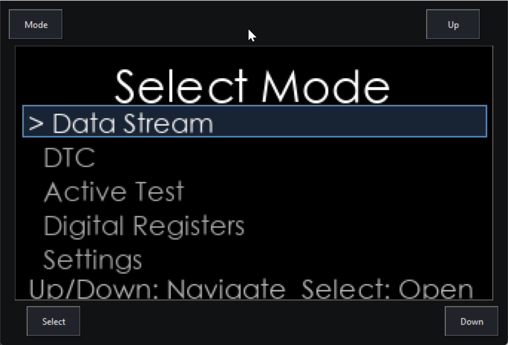
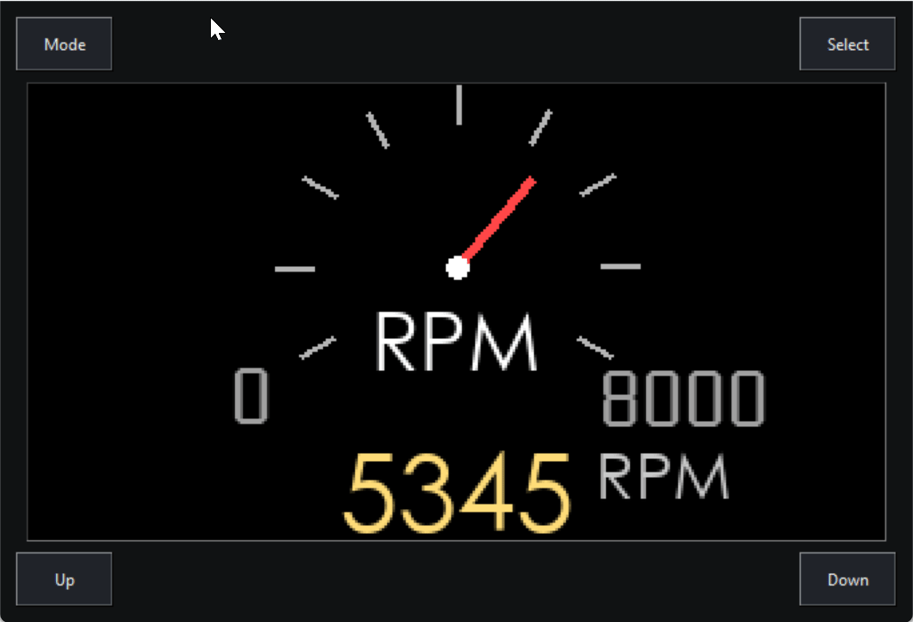
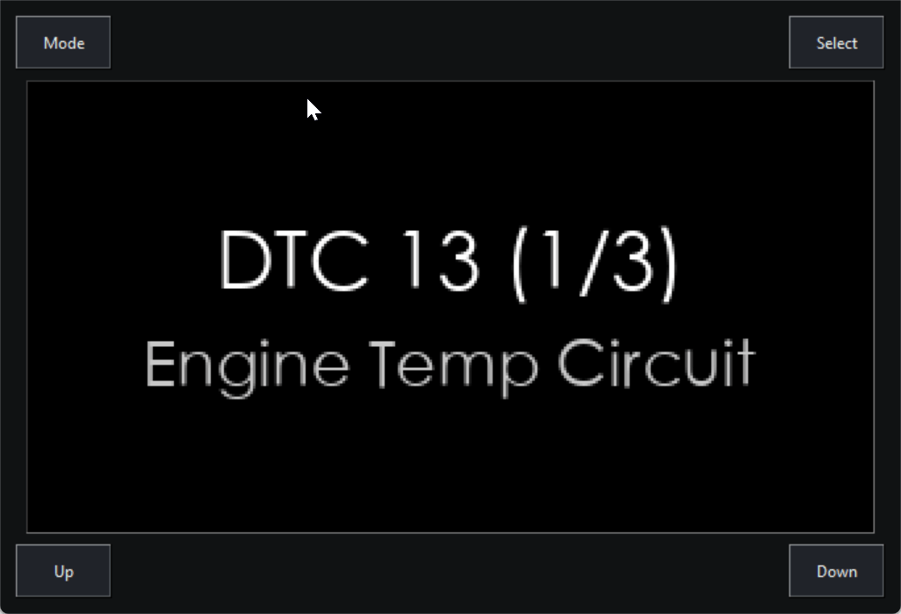
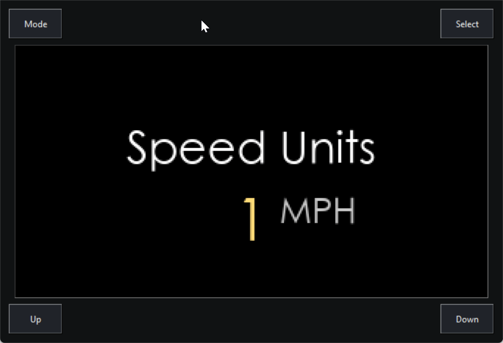
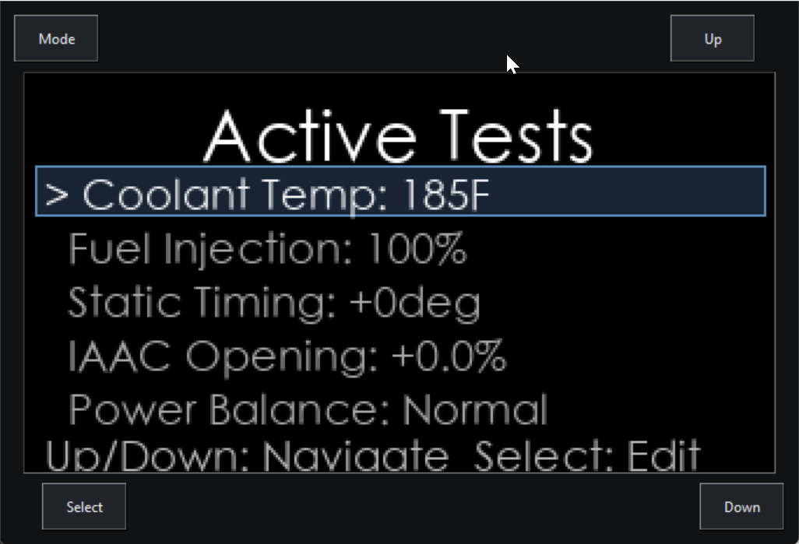
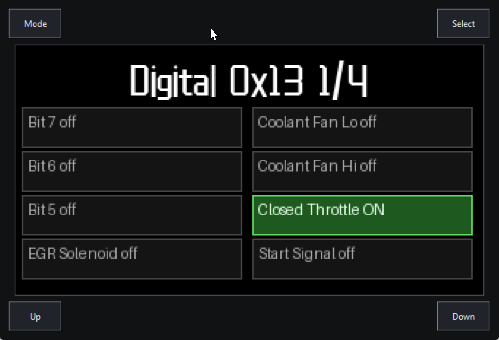

# PiConsult by Swestastic

## Description

This project uses Python to record data over serial on a Raspberry Pi and then display it on a small SPI display. Tested on 1990 NA/MT 300zx and 2001 NA/MT S15 Silvia ECUs. Should support most other similar-era cars, but this has not been tested.

## Current Functionality

### Mode selection menu

Allows selection of modes between Data Stream, DTC, Active Test, Digital Registers, and Settings. Use Up/Down to navigate and Select to choose an option.

### Mode 1: Data stream

Reads the following data from the ECU and can display live data on the screen. Displayed value changes with button press of Up/Down. Press Select to see the peak value stored during this drive.

The values displayed can be chosen in Settings → Read Parameters. Note that not all parameters are supported on all ECUs (Ex. RH MAF Voltage is only available on ECUs which support 2 MAF sensors, such as RB26DETT). For cars with only one O2 sensor or MAF, use the LH parameter. Up to 20 parameters can be read at once, although using only what is necessary may help performance.

Supported parameters:

- Engine RPM
- LH / RH MAF Voltage
- Coolant Temperature
- LH / RH O2 Voltage
- Vehicle Speed
- Battery Voltage
- TPS Voltage (Throttle position)
- Intake Air Temperature
- Exhaust Gas Temperature
- LH / RH Injection Time
- Ignition Timing
- AAC Duty Cycle
- LH / RH Air Fuel Alpha
- LH / RH Air Fuel Alpha Self Learn
- Digital Register 0x13 (A/C switch, Power Steering, Neutral/Park, Start signal, closed TPS)
- Digital Register 0x1E (A/C Relay, Fuel Pump Relay, VTC solenoid, Coolant Fan Hi, Coolant Fan Lo)
- Digital Register 0x1F (P/Reg control, Wastegate Solenoid, IACV/FICD Solenoid, EGR Solenoid)
- Digital Register 0x21 (LH Bank Lean, RH Bank Lean)

### Mode 2: DTCs

Reading of Data Trouble Codes (DTCs) and ability to clear stored DTCs. Cycle through stored DTCs with Up/Down. Press Select to clear stored ones.

### Mode 3: Settings

Settings adjustment mode with the following options:

- Speed Units (MPH/KPH)
- Temperature Units (F/C)
- Speed Correction
- Default Display
- RPM Warning threshold
- Coolant Temp Warning threshold

### Mode 4: Active Test

Active Testing mode with the following functions:

- Manual selection of coolant temp
- Increase/decrease injector pulse width
- Increase/decrease base ignition timing
- Increase/decrease IACV duty cycle
- Power balance test
- Fuel pump on/off
- Clear self learn trims

### Mode 5: Digital Bit Register

View binary values in the ECU that tell you when solenoids or other switches are triggered

**0x13:** A/C switch, Power Steering, Neutral/Park, Start signal, closed TPS

**0x1E:** A/C Relay, Fuel Pump Relay, VTC solenoid, Coolant Fan Hi, Coolant Fan Lo

**0x1F:** P/Reg control, Wastegate Solenoid, IACV/FICD Solenoid, EGR Solenoid

**0x21:** LH Bank Lean, RH Bank Lean

## Current Bugs/Issues/ToDos

- Active tests not disabling cleanly
- Low framerate on Pi with gauge display
- Fix screen centering in STL files
- Fix footer inconsistencies in some menus
- There may be some bugs in the DTC reader, I've been getting inconsistent results.
- Inconsistent Up/Down behavior (Up/Down buttons are switched on some menus)
- `configJSON.json` Read Parameters are magic numbers, should be actual read parameters or registers
- Text is cut off in some menu items, needs to be scrolling or wrapped
- Crash logs don't seem to be working correctly

## Future Features

- More active test options
- Modes for adjusting TPS (display throttle closed + tps voltage on same screen) and for timing/idle lockout
- Display items based on ECU P/N (i.e. only display Power Balance cylinder 1-4 for 4-cylinder engines, display both left and right bank O2 sensors for V6 or V8, etc. Additionally, some registers may be different for different ECUs, so that will need to be explored.)
- Multiple readouts on the same page
- A/C, HICAS, Airbag computer support (possibly)
- Auto read COM port if using laptop
- Auto reconnection
- Data log saving
- MPG Calculation

## Prerequisites

- [Raspberry Pi Zero 2 W](https://www.raspberrypi.com/products/raspberry-pi-zero-2-w/) with Raspbian OS or similar
- [WaveShare LCD 1.9in screen](https://www.waveshare.com/wiki/1.9inch_LCD_Module)
- Python 3.x with packages from `requirements.txt`
- [Nissan Consult Cable](https://conceptzperformance.com/plms-developments-plms-nissan-consult-interface-usb-cable-nistune-datscan-etc-1005_p_5664.php) (There are cheaper consult readers on eBay for $15-$20, but I have not tested these)
- 3D Printer for printing the 3 included STL files (it is recommended to use a filament that will last inside of a car, such as PETG, ABS, or ASA, especially if it is parked outside)
- 4x Screws (Need to confirm size on these)
- [4x two pin 6x6x5 buttons](https://www.amazon.com/dp/B07X8T9D2Q)

## Software Installation

1. Set up your Pi with Raspbian or a similar OS (enabling SSH may be helpful for testing or debugging!)
2. Clone the repo onto the Pi
3. Install the required Python packages on the Pi: `pip install -r requirements.txt`
4. Set `ConsultStart.sh` to run at boot [Reference Link](https://zt4ff.medium.com/running-scripts-on-boot-in-linux-using-systemd-e10d3606f28f) Be sure to update `ConsultStart.sh` with the correct path based on where it's located in your filesystem!
5. Make sure SPI/I2C is enabled in raspi-config [Reference Link](https://www.waveshare.com/wiki/1.9inch_LCD_Module)

## Physical Assembly

First connect all of your wires according to the following pinout:

**Missing Photo**

Next, install the pi into the main body. It should click onto the 4 pegs

**Missing Photo**

Place the OLED screen inside of the sandwich plate and connect the wires on the back

**Missing Photo**

Place the 4x buttons in the supplied slots and connect the wires on the back. Each button should have 1 pin connected to ground, and then the other pins are wired as follows:

Mode → GPIO 26

Select → GPIO 16

Up → GPIO 23

Down → GPIO 17

**Missing Photo**

Insert the faceplate on top and fasten with 4x screws

**Missing Photo**

Connect to the Pi at the back of the case with a 5V power wire (USB charger in the cigarette lighter is easiest) and connect the consult cable to the USB port using an OTG cable.

**Missing Photo**

Connect the other end of the Consult cable underneath the dashboard

**Missing Photo**

Turn on the car and you should be ready to go! Make sure to configure settings as necessary

**Missing Photo**

## Local Desktop Mode (Laptop/Windows/macOS/Linux)

You can run the project without a Raspberry Pi display. A popup window is used as a virtual LCD, and on-screen Mode/Select/Up/Down buttons drive the same app logic. This is largely just used for testing, but you could use it functionally as well.

1. Install dependencies: `pip install -r requirements.txt`
2. Optional: force desktop mode with `CONSULT_LOCAL_UI=1`
3. Optional: set popup scale with `CONSULT_LOCAL_SCALE=2` (integer)
4. Run demo mode locally (no ECU required): `python Main.py --demo`

Notes:

- Desktop mode is selected automatically when Pi hardware dependencies are unavailable.
- On Raspberry Pi, hardware display and GPIO behavior remain the default unless `CONSULT_LOCAL_UI=1` is set.
- No functionality is built in yet for changing COM port. In the `PortConnect` function in `main.py` you can manually specify a com port. If using the Raspberry Pi USB port, then you can use this line `return serial.Serial("/dev/ttyUSB0", 9600, timeout=None)`, alternatively for Windows I comment that line out and instead use `return serial.Serial("COM6", 9600, timeout=None)` (Note that "COM6" will probably be a different port on your machine, use Device Manager to check)

## Configuration

- `Dependencies/config.py` contains hardware configuration for GPIO/SPI/I2C interfaces.
- `Dependencies/configJSON.json` contains runtime settings and defaults.

## Contributing

I am actively looking for other contributors to help keep this project going! Ultimately this is something that I made for personal use, but decided to publish since I think the community could benefit from it. To keep long term support, add features, and improve the project all around I will need additional help :). Feel free to open issues, fork the repo, and open pull requests for bug fixes, additional features, etc.

The local UI is there for testing, although updates should be tested on Pi hardware as well before they're merged. You can message me `Discord: @swestastic` as well for any clarifications or questions on how things are set up.

## Acknowledgements

Thanks to [fridlington](https://github.com/fridlington) for the K11 consult program which much of the data steaming is based off of and [gregsqueeb](https://github.com/gregsqueeb) for inspiring me to take this project on after seeing his implementation of a consult dash. The smaller form factor and design were inspired by the [Yashio Factory OkaChan](https://yashiofactory.co.jp/en/product/okachan-water-temp-3/). Thanks to everyone who is helping to keep these golden era Nissans alive!
